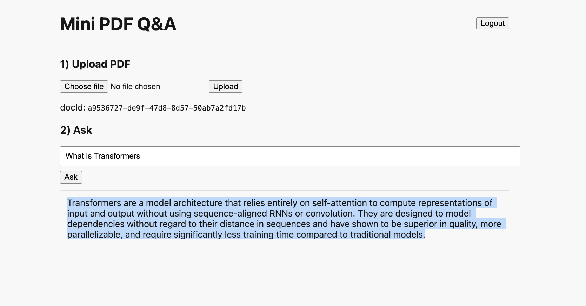

# Mini PDF Q&A (Minimal)

This is a minimal Next.js app that fulfills the task:
Approach

PDF Upload & Processing
The user uploads a PDF via a protected API route.
Text is extracted using pdf-parse.
The extracted text is split into overlapping chunks for better context handling.

Embedding Generation & Storage

Each text chunk is converted into a vector embedding using OpenAI (text-embedding-3-small by default).
These embeddings are stored in a vector database (Upstash Vector) along with metadata (document ID, index, snippet).

Question Answering (RAG)

The user submits a question via another protected route.
The system performs a vector similarity search to retrieve the most relevant chunks.
These chunks are sent to OpenAI to generate a contextual answer.
Authentication
All backend routes are protected by a simple password-based session system (APP_PASSWORD).

Quick start:
1. Install dependencies: `npm install`
2. Copy `.env.example` to `.env.local` and fill values.
3. Run: `npm run dev`
4. Visit: http://localhost:3000/login (use APP_PASSWORD), then /

